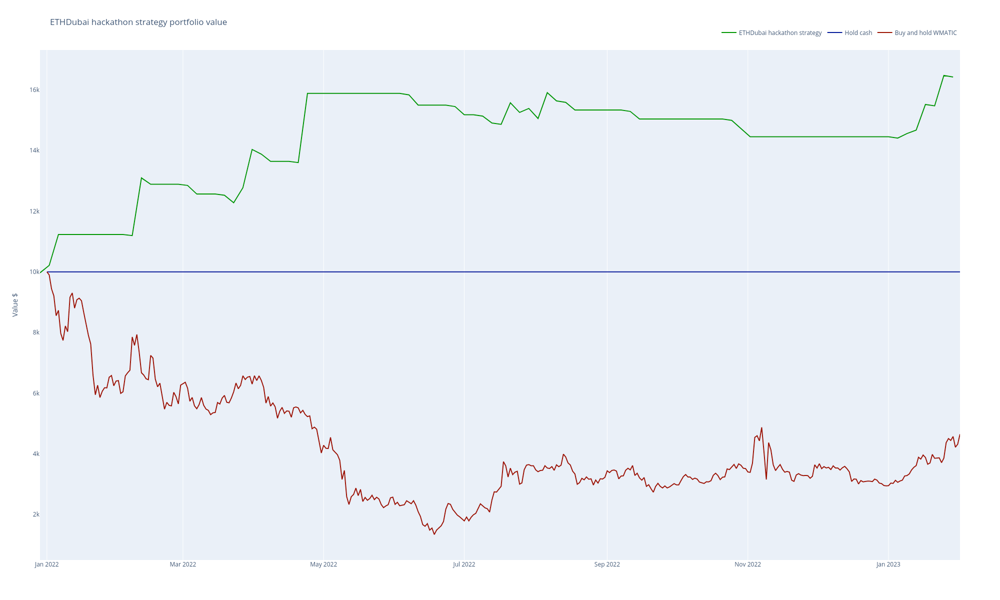
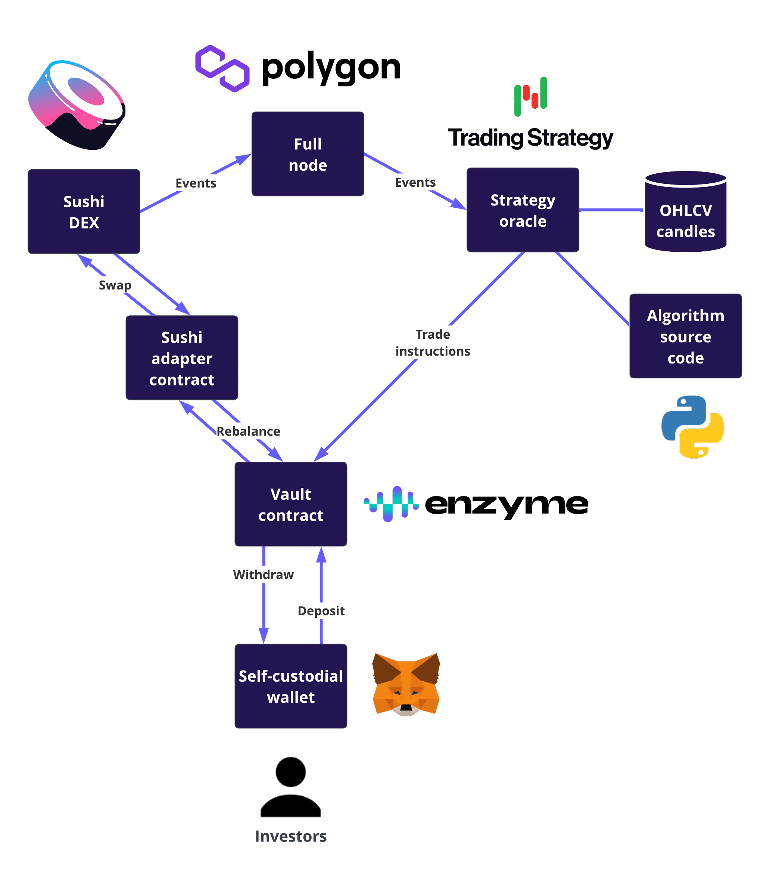

This is the Github repository for **Citade-Sashimi** EthDubai hackathon project.
The project implements non-custodial user investable automated trading strategies on the top of Sushi DEX.

The hackathon comes with one example trading strategy, but it's easy to customise the approach for the multiple professional-grade quant finance strategies. The strategies can be written in high-elvel Python, using on-chain data sources and 150+ technical indicators out of the box. No Solidity or low level blockchain knowledge is needed.

# Goal

**Citade-Sashimi** benefits decentralised finance users and Sushi

- For **DeFi users** the project offer professional grade investable trading strategies with features like portfolio rebalancing, stop loss
  alpha signals, position risk sizing and liquidity awareness. The advanced
  risk management features of the automated strategy make DeFi trading safer for users
  than what they would likely to be execute manually.
- For **cryptocurrency trades** non-custodial DeFi is safer than hack prone
  and opaque centralised services like **FTX** or **3Commas**.
- For **Sushi** and its **liquidity provides** offers high quality market taker volume. 
- For **strategy developers** there is high-level, easy to use, and much more powerful tooling what mere Solidity smart contracts can do. There is also opportunity for profit-sharing as Enzyme Vaults offer on-chain fund management features.

The trading strategies are based on real yield that comes for trading profits.
Typical active trading strategies may include strategies like mean reversion, momentum and trend following.  Active trading provides more sustainable yield than liquidity mining, as it is based on true profits. 

# Deliverables

In this hackathon we created

- Sushi adapter smart contract for Enzyme Vaults, so that trading strategies can perform rebalances using Sushi liquidity (see source, see Polygon smart contract)
- Trading Strategy backtesting and strategy development notebook for [creating trading algorithmic on the top of Sushi trading pairs and market data feeds].
- SvelteKit frontend that allows you to connect the wallet and invest the Enzyme Finance vault smart contract that is controlled by Trading Strategy oracles

# How does it work

- The trading strategy source code was developed by the hackathon team
- The trading strategy oracles run the the strategy source code offchain
- Oracles send trade instructions to the Enzyme vault smart contract using Sushi adapter
- The vault trades on Sushi DEX
- Users can invest and withdraw to the vault
- The vault automatically calculates profit sharing, shares, etc.

# Example trading algorithm

We created [an example trading strategy](https://github.com/tradingstrategy-ai/ethdubai-2023-hackathon/blob/master/notebook/ethdubai-hackathon.ipynb) based on [portfolio construction](https://tradingstrategy.ai/glossary/portfolio-construction) methodology.

We performed a backtest 

- The strategy performance and cash reserves are denonimated in USDC
- Only long positions, spot market
- Trade on Sushi DEX, Polygon only
- Momentum trading
- Rebalance every 4 days
- Choose top three assets based on alpha signals
- Risk management:
  - Have min. available liquidity USD 300k for each asset traded 
  - Take profit triggers at 33%
  - Stop loss triggers at 3% 
  - Use 1/nth portfolio allocation
  - Maintain 50% cash buffer
- Strategy performance
  - Backtesting 2022-01-01 - 2023-02-01 (396 days)
  - Annualised estimated return 64% 
  - LP fees paid ~$1000
  - Max pullback -10%
- Don't trade on bear market, indicated by MATIC token 15 days simple moving average (SMA) price

The strategy performance vs. buy-and-hold MATIC.


    
[See the strategy notebook bactesting results](https://github.com/tradingstrategy-ai/ethdubai-2023-hackathon/blob/master/notebook/ethdubai-hackathon.ipynb) on Github for more statistics, or run the backtest yourself using the instructions below.

**Note** Because the strategy performs rebalance trades ~once per week, we cannot show any live trading results within the EthDubai hackathon period. We did some initial [smoke testing trades using Python scripting](https://github.com/tradingstrategy-ai/ethdubai-2023-hackathon/tree/master/hackathon) to show that the live portfolio rebalance works against Sushi liquidity.   

# Architecture



- **Polygon** blockchain for the underlying chain 
- **Sushi** DEX for the trading venue
- **Enzyme Finance** vaults smart contracts for managing strategy portfolio, investor shares and profit sharing
- **Trading Strategy** oracle for market data feeds, strategy development and backtesting
- **Foundry** for smart contract development
- **SvelteKit** frontend for the website

# Development

For building yhe project you need

- Foundry
- Python
- Poetry

This repository contains Git submodules.

Include them:

```shell
git submodule update --init --recursive     
```

# Contracts

We have one in-house adapter contract and then a complex suite of contracts from other protocols.

- Contract compilation and deployment is managed by Forge
- Depends on Enzyme and OpenZeppelin
- Enzyme protocol is used for the investment vault
- [Enzyme protocol is already deployed on Polygon](https://docs.enzyme.finance/developers/contracts/polygon)
- We deploy a special Enzyme vault that is using custom SushiAdapter for connecting
  trade instructions to the investment vault and then to Sushi protocol
- Enzyme protocol is already deployed on Polygon, so we do not deploy it
- The Trading Strategy oracle is set up as a fund manager for the vault

See the deployed contracts on PolyScan

- [Sushi adapter for Enzyme Protocol and Trading Strategy oracle](https://polygonscan.com/address/0x8b326FC39d222a7f8A6a210FBe3CDCDb2C2b62Ed#code)
- [Deployed Enzymy vault](https://polygonscan.com/address/0x8890a249dfe790656a1a41c1515d266ed31b8525#code)
-[Deployed Enzyme comptroller](https://polygonscan.com/address/0xC5d4A84e4D81835C597051491E0F48F8DE6819Dc)

To compile:

```shell
cd forge 
forge build              
```

The vault is deployed and configured using `hackathon/deploy.py`

- Currently there is only one inhouse smart contract that is Enzyme-Sushi-Trading Strategy adapter
- We depend on [web3-ethereum-defi](https://github.com/tradingstrategy-ai/web3-ethereum-defi) package that contains 600+ precompiled Defi smart contracts
- We deploy Enzyme vault using our deployment script, ABI files from `web3-ethereum-defi`
  and ABI files we compiled using Forge

```shell
# Set up secrets for commands used in this README
source env/local.env  

# 0x92fcde09790671cf085864182b9670c77da0884b is Enzyme IntegrationManager on Polygon
# https://docs.enzyme.finance/developers/contracts/polygon
 forge create \
  --constructor-args 0x92fcde09790671cf085864182b9670c77da0884b \
  --rpc-url $JSON_RPC_POLYGON \
  --private-key $PRIVATE_KEY \
  --etherscan-api-key $ETHERSCAN_API_KEY \
  --verify \
  src/SushiAdapter.sol:SushiAdapter
```

If/when PolygonScan contract verify fails please try again:

Deployer: 0x454E9F5219CD92BCAa8c5C0406c16fdA6116b342
Deployment address: 0x8b326FC39d222a7f8A6a210FBe3CDCDb2C2b62Ed

```shell
forge verify-contract \
    --chain-id 137 \
    --watch \
    --constructor-args $(cast abi-encode "constructor(address)" "0x92fcde09790671cf085864182b9670c77da0884b") \
    --compiler-version 0.6.12+commit.27d51765 \
    --etherscan-api-key $ETHERSCAN_API_KEY \
    0x8b326FC39d222a7f8A6a210FBe3CDCDb2C2b62Ed \
    src/SushiAdapter.sol:SushiAdapter     
```

# Strategy code

Strategy code is available as Python module that is read by [Trading Strategy oracles](https://tradingstrategy.ai/docs/protocol/index.html). 

- [See and run Jupyter backtesting environment](https://github.com/tradingstrategy-ai/ethdubai-2023-hackathon/blob/master/notebook/ethdubai-hackathon.ipynb) 
- [View live strategy Python module](https://github.com/tradingstrategy-ai/ethdubai-2023-hackathon/blob/master/strategy/ethdubai-hackathon.py) 

To install

``shell
poetry install
``

To open the backtesting Jupyter notebook for the strategy development locally:

```shell
poetry shell
jupyter notebook
```

# Frontend

Frontend is written in SvelteKit.

# Oracle

- Oracle is the server-side process the market feeds and drives strategy
- Run [trade-executor Python package](https://github.com/tradingstrategy-ai/trade-executor/) to run the oracle 
- Oracle is deployed manually using Docker
- Oracle trades once in a week so unfortunately we could not demostrate any live trading in hackathon
- [Deployment instructions are in the trade-executor documentation](https://tradingstrategy.ai/docs/running/strategy-deployment.html)
- Multiple oracles can be deployed and configured to voting to make oracle
  execution decentralised